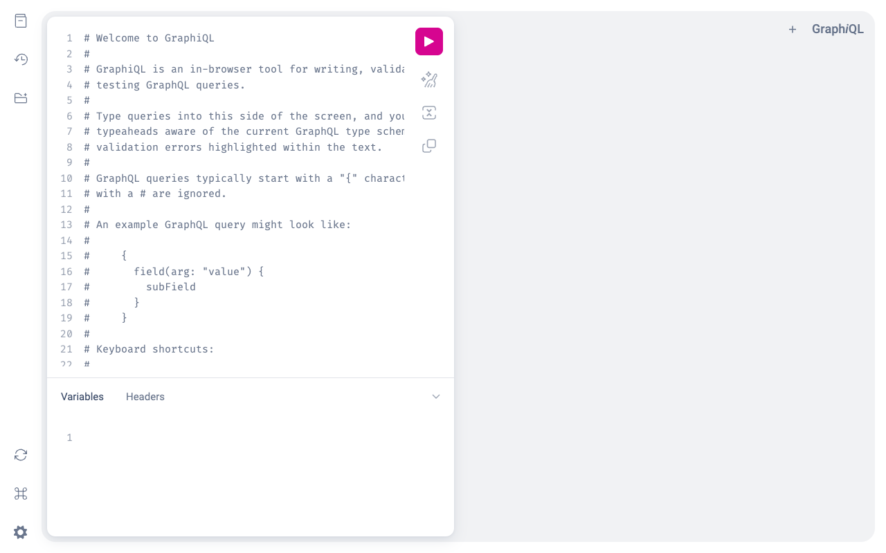
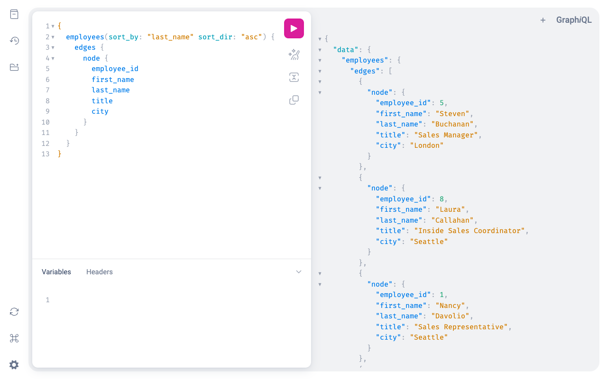
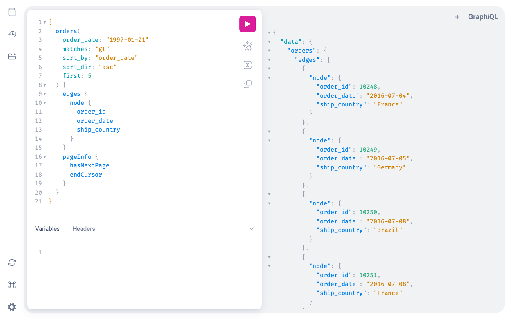
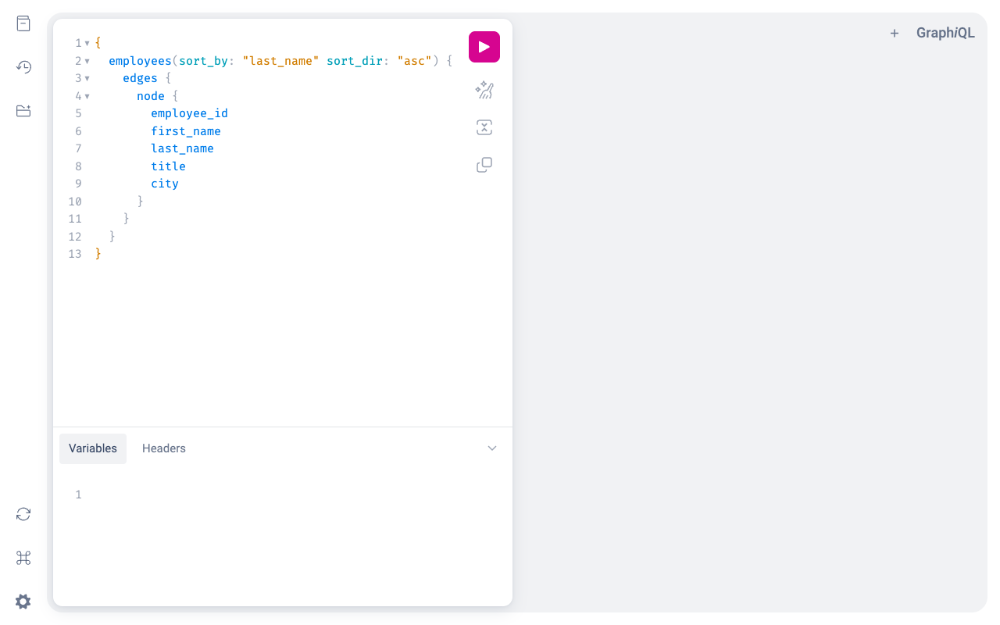
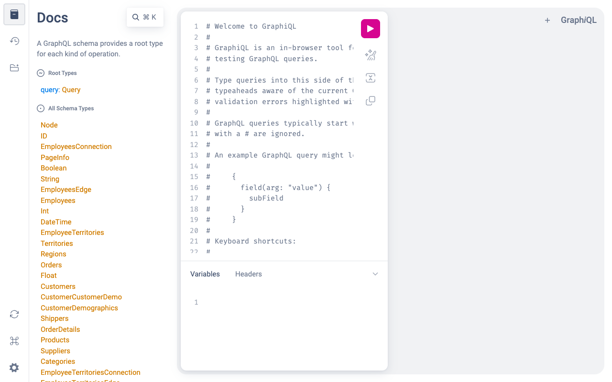
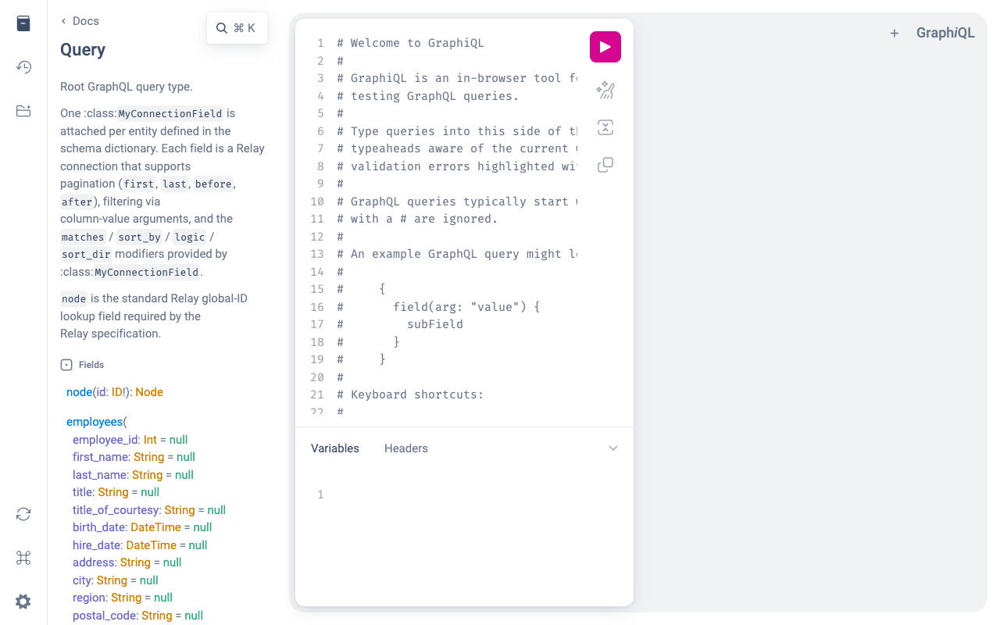

# Grapinator GraphiQL User Guide

## Overview

GraphiQL is an interactive, browser-based IDE for exploring and querying the Grapinator GraphQL API. It provides auto-complete, inline documentation, query history, and a schema explorer — no additional tools or authentication required.

---

## Accessing GraphiQL

Open your browser and navigate to the API endpoint:

```
http://localhost:8443/northwind/gql
```

> **Note:** The host, port, and path may differ in your deployment. Check with your administrator if the default URL does not respond.

---

## Interface Layout

When you first open GraphiQL you will see the default landing page with the query editor on the left and a blank results panel on the right.



The interface is divided into four areas:

| Area | Location | Purpose |
|---|---|---|
| **Toolbar** | Left edge (icons) | Navigation: History, Explorer, Schema re-fetch, Shortcuts, Settings |
| **Query Editor** | Centre-left (large panel) | Write your GraphQL queries here |
| **Results Panel** | Centre-right (large panel) | JSON response appears here after running a query |
| **Variables / Headers** | Bottom of the editor panel | Supply variable values or custom HTTP headers |
| **Docs Explorer** | Slides out from the left | Browse all available types, fields, and arguments |

---

## Running Your First Query

1. Click in the **Query Editor** (left panel) and clear any existing content.
2. Type or paste a query, for example:

```graphql
{
  employees(sort_by: "last_name" sort_dir: "asc") {
    edges {
      node {
        employee_id
        first_name
        last_name
        title
      }
    }
  }
}
```

3. Press the **▶ Run** button (or `Ctrl+Enter` / `Cmd+Enter`) to execute.
4. Results appear as JSON in the right panel.



---

## Query Structure

All Grapinator queries follow the same Relay connection pattern:

```graphql
{
  <entity_name>(<filter_args>) {
    edges {
      node {
        <field1>
        <field2>
        ...
      }
    }
  }
}
```

- **`<entity_name>`** — the data set to query (e.g. `employees`, `orders`, `products`)
- **`edges { node { ... } }`** — Relay wrapper required to access individual records
- **`<field1>, <field2>`** — the columns you want returned

---

## Filtering Results

Pass field values as arguments to filter results. Multiple fields are combined with AND logic by default.

### Basic filter — match by field value

```graphql
{
  employees(city: "Seattle") {
    edges {
      node {
        first_name
        last_name
        city
      }
    }
  }
}
```

### Filter mode — `matches` argument

The `matches` argument controls how the filter value is compared. Default is `contains`.

| `matches` value | Behaviour | Example |
|---|---|---|
| `contains` *(default)* | Case-insensitive substring match | `"Smith"` matches `"Blacksmith"` |
| `exact` or `eq` | Exact equality | `"Smith"` matches only `"Smith"` |
| `startswith` or `sw` | Value starts with string | `"Sm"` matches `"Smith"` |
| `endswith` or `ew` | Value ends with string | `"th"` matches `"Smith"` |
| `regex` or `re` | Regular expression match | `"^S.*h$"` matches `"Smith"` |
| `lt` | Less than | numeric or date comparison |
| `lte` | Less than or equal | numeric or date comparison |
| `gt` | Greater than | numeric or date comparison |
| `gte` | Greater than or equal | numeric or date comparison |
| `ne` | Not equal | excludes matching records |

**Example — exact match:**

```graphql
{
  employees(city: "Seattle" matches: "exact") {
    edges {
      node {
        first_name
        last_name
        city
      }
    }
  }
}
```

**Example — date range (orders after 1997-01-01):**

```graphql
{
  orders(order_date: "1997-01-01" matches: "gt" sort_by: "order_date" sort_dir: "asc") {
    edges {
      node {
        order_id
        order_date
        ship_country
      }
    }
  }
}
```



---

## Sorting Results

Use `sort_by` and `sort_dir` to control result order.

| Argument | Values | Default |
|---|---|---|
| `sort_by` | Any field name (string) | Entity's default sort column |
| `sort_dir` | `asc`, `desc` | `asc` |

```graphql
{
  products(sort_by: "unit_price" sort_dir: "desc") {
    edges {
      node {
        product_name
        unit_price
      }
    }
  }
}
```

---

## Combining Filters with OR Logic

By default multiple filters are combined with AND. Use `logic: "or"` to switch to OR.

```graphql
{
  employees(city: "Seattle" logic: "or" country: "UK") {
    edges {
      node {
        first_name
        last_name
        city
        country
      }
    }
  }
}
```

---

## Pagination

Grapinator uses Relay cursor-based pagination. Use `first` to limit the number of results. The `pageInfo` block provides cursor values for fetching subsequent pages.

The **Variables** tab at the bottom of the editor panel lets you pass JSON variable values into parameterised queries instead of hardcoding them directly.



Use `first` to limit the number of results:

```graphql
{
  orders(first: 10 sort_by: "order_date" sort_dir: "desc") {
    edges {
      node {
        order_id
        order_date
        freight
      }
    }
    pageInfo {
      hasNextPage
      endCursor
    }
  }
}
```


To fetch the next page, pass the `endCursor` value as the `after` argument:

```graphql
{
  orders(first: 10 after: "<endCursor value>" sort_by: "order_date" sort_dir: "desc") {
    edges {
      node {
        order_id
        order_date
        freight
      }
    }
    pageInfo {
      hasNextPage
      endCursor
    }
  }
}
```

---

## Traversing Relationships

Fields referencing related tables can be nested directly in your query. No separate joins are required.

```graphql
{
  orders(customer_id: "ALFKI") {
    edges {
      node {
        order_id
        order_date

        employee {
          first_name
          last_name
        }

        customer {
          company_name
          phone
        }
      }
    }
  }
}
```

Relationships can be nested multiple levels deep:

```graphql
{
  order_details(order_id: 10248) {
    edges {
      node {
        quantity
        unit_price

        product {
          product_name

          category {
            category_name
          }

          supplier {
            company_name
            country
          }
        }
      }
    }
  }
}
```

---

## Using the Schema Explorer (Docs)

Click the **Docs** button in the top-right corner to open the schema explorer. This panel lets you browse every available entity, field, and argument without writing a query.



**To explore an entity:**
1. Click **Query** at the root level.
2. Click any entity name (e.g. `employees`) to see its available filter arguments.
3. Click on a type name to drill into its fields.



**Deprecated fields** are hidden by default. Toggle **"Show Deprecated Fields"** inside the explorer to reveal them — deprecated fields display a strikethrough name and the deprecation reason explaining what to use instead.

---

## Keyboard Shortcuts

| Shortcut | Action |
|---|---|
| `Ctrl+Enter` / `Cmd+Enter` | Run query |
| `Ctrl+Space` | Trigger auto-complete |
| `Shift+Ctrl+P` / `Shift+Cmd+P` | Prettify / format query |

---

## Auto-complete

Press `Ctrl+Space` (or `Cmd+Space`) at any point in the query editor to see available options for the current cursor position — entity names, field names, argument names, and valid enum values are all suggested automatically.

---

## Common Errors

| Error | Likely cause |
|---|---|
| `Cannot query field "X" on type "Y"` | Field name is wrong or does not exist — check spelling in the Docs panel |
| `Unknown argument "X"` | Argument name is wrong — use auto-complete to see valid arguments |
| `Expected type String, found Int` | Value type mismatch — wrap string values in double quotes |
| Empty `edges` array | Query ran successfully but no rows matched the filter |
| Network error / cannot connect | Server is not running or the URL is incorrect |

---

## Further Reading

- [demo_queries.md](demo_queries.md) — ready-to-run example queries for every entity
- [schema_docs.md](schema_docs.md) — full schema reference including field descriptions and relationship definitions
